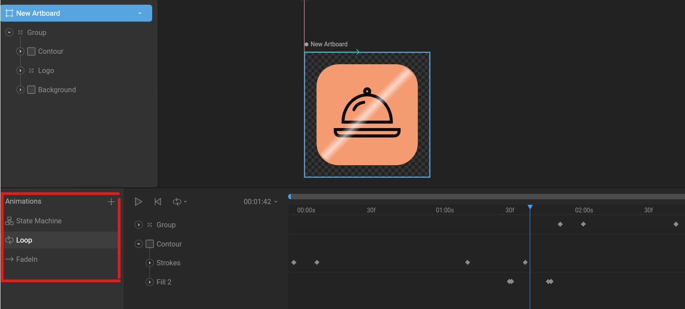

# RIVE App

## Animez vos applications

RIVE est une application open source qui permet de créer des animations (ou récupérer des existantes) directement sur votre navigateur pour dynamiser vos sites et applications en les intégrant facilement sur (presque) toutes plateformes !

## Installation

Avec une application React :

placez vous dans votre projet, sur le terminal utilisez

`npm i --save @rive-app/react-canvas`

Sur [ce lien](https://help.rive.app/runtimes/overview) vous trouverez les consignes d'installation de Rive pour une multitude de technos (**Web, Angular, Vue, Flutter...**)

## Implémentation dans votre application

Pour importer des animations 'classiques' (qui ne sont pas intéractives), dans votre page :

```js
import Rive from '@rive-app/react-canvas';

function Tutorial() {
    return <Rive src="assets/ynov.riv" />;
}

export default function Tutorial;
```

## Comment on fait une animation ?

- Créer ou importer un **design**
  Vous pouvez créer un design à la main avec les outils mis à
  disposition ou en importer directement dans Rive. Certains formats
  (.svg) permettent d'identifier les formes et contours à l'intérieur
  de l'image, ce qui peut être très utile pour animer les parties de
  votre design indépendamment.

- Créer ou importer une **animation** sur votre design

Une animation peut se jouer une fois, faire des allers-retours (ping-pong) ou encore boucler.

Un même design peut avoir plusieurs animations et il est possible de les enchaîner ou d'en jouer une particulière.

Pour ceux qui aimeraient découvrir la création d'animation, je conseille [ce tuto](https://help.rive.app/tutorial/bouncing-ball). Il est rapide et très simple pour une première approche.

:bulb: Vous avez à disposition les créations de la **communauté**,
que vous pouvez importer pour les utiliser ou pour les re-travailler
ou par exemple comprendre comment elle a été faite. **Cette feature est
très utile pour apprendre à créer !**

- State Machine
  Pour gérer plusieurs animations sur un même design, on peut utiliser
  la _State machine_, qui suit des logiques de déclenchements pour les
  différentes animations. Ce procédé se fait par un dessin technique
  (qui s'apparente à du Blueprint).

Dans l'exemple ci-dessous, on peut voir dans l'encadré en bas à
gauche 2 animations, **_FadeIn_** et **_Loop_**, qui peuvent être gérées
dans le **_State Machine_**.



Dans notre exemple de State Machine, la logique de cette animation
est simple et s'excute comme suit : Elle joue en premier l'animation
FadeIn qui est en One shot, une fois l'animation finie on passe à la
Loop qui va comme son nom l'indique jouer en boucle.


## Utilisation de `useRive`

Qu'on ait une ou plusieurs animations, on peut implémenter dans notre code des `listeners` permettant de gérer des évènements (`onClick`, `onMouseEnter`...)

Pour cela, on modifiera notre import pour utiliser le Hook `useRive` (toujours en React pour l'exemple)

```js
import { useRive } from '@rive-app/react-canvas';

function Tutorial() {
  const params = {
    src: 'img/ynov.riv',
    autoplay: false,
  };
  const { RiveComponent, rive } = useRive(params);

  return (
    <RiveComponent
      onMouseEnter={() => rive && rive.play()}
      onMouseLeave={() => rive && rive.pause()}
    />
  );
}

export default Example;
```

Dans cet exemple, on peut jouer une animation lorsque la souris est sur l'emplacement du design.

En modifiant légèrement ce code, on peut intégrer la logique de la State Machine et jouer des animations autres. Par exemple, l'animation se lance dès le début avec `autoplay: true` et lorsque notre souris passe au dessus, on jouera une deuxième animation en précisant en paramètre de `rive.play()`:

```js
<RiveComponent
    onMouseEnter={() => rive && rive.play(["Animation 1"])}
    onMouseLeave={() => rive && rive.pause(["Animation 1"])}
/>
```

On peut enrichir notre interactivité et nos enchainements avec d'autres paramètres comme `onPlay?` ou `onLoop?` qui permettent de contrôler le moment où une animation se lance ou finit sa boucle par exemple.
